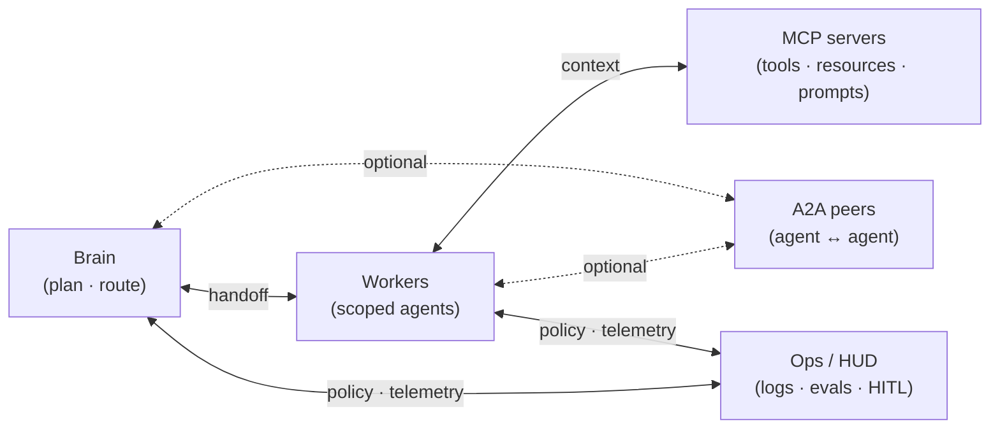

# Multi-agent runtime reference

Vendor-agnostic layers: **brain · workers · ops**. Goose, Cursor, Codex, and CLIs are *examples*, not dependencies. Staff teams swap a host without rewriting the domain.

This repository is the layer model and the decision log. It is not a product, an SDK, or a host. The GitHub name `jarvis-architecture` is the repo id, not a runtime you install.

Maintainer: [Tiago Montanha](https://github.com/tiagovilasboas) · Staff · Agentic AI

---

## Model

| Layer | Responsibility |
|---|---|
| Brain | Plan, decompose, route |
| Workers | Narrow scope + tools ([MCP](https://modelcontextprotocol.io/docs/learn/architecture)) |
| Ops | Logs, evals, HITL on writes |

Prefer [simple, composable patterns](https://www.anthropic.com/engineering/building-effective-agents) (for example orchestrator-workers). Use [A2A](https://a2a-protocol.org/latest/topics/what-is-a2a/) when agents must collaborate as peers. Do not wrap agents as tools.

**Week-1 (brain → workers → ops):** [docs/cookbook-handoff.md#week-1](docs/cookbook-handoff.md#week-1).

**Broken handoff → ops reconstruction:** [docs/cookbook-handoff.md#broken-handoff](docs/cookbook-handoff.md#broken-handoff). Fixtures: [`examples/handoff.broken.json`](examples/handoff.broken.json) · [`examples/handoff.fixed.json`](examples/handoff.fixed.json).

**Swap a host without rewriting the domain:** [docs/swap-runtime.md](docs/swap-runtime.md).

**When to open a sibling instead:** [docs/when-vs-grok-bot.md](docs/when-vs-grok-bot.md).

---

## ADRs

Decision log (index + status): [docs/adr/README.md](docs/adr/README.md). Format: [adr.github.io](https://adr.github.io/).

- [0001. Brain vs workers](docs/adr/0001-brain-vs-workers.md)
- [0002. HITL on writes](docs/adr/0002-hitl-on-writes.md)
- [0003. Vendor-agnostic](docs/adr/0003-vendor-agnostic.md)
- [0004. Handoff contracts](docs/adr/0004-handoff-contracts.md)
- [0005. Ops owns reconstruction](docs/adr/0005-ops-owns-reconstruction.md)

---

## Related

This repo is the layer model. Siblings are scoped kits, not implementations of these ADRs and not ports of each other. Honest split: [when to use this vs grok-bot vs kiro-crew](docs/when-vs-grok-bot.md).

- [kiro-crew](https://github.com/tiagovilasboas/kiro-crew): Crew pattern (Planner → Implementer → Reviewer → Ops). Pasteable cards. Kiro is the example host.
- [grok-bot-architecture](https://github.com/tiagovilasboas/grok-bot-architecture): Desktop assistant OS (chief-of-staff, specialists, shared computer, connectors).
- [awesome-agentic-ai](https://github.com/tiagovilasboas/awesome-agentic-ai): Curated list (MCP · harness · AppSec). Decision filter, not architecture.
- [agent-measurement](https://github.com/tiagovilasboas/agent-measurement): Evals (suites, named metrics, markdown reports). Measure; do not train.
- [agentic-code-review](https://github.com/tiagovilasboas/agentic-code-review): AppSec PR review (skills, runbooks, `path:line` or silence).

Public refs: [Goose architecture](https://block-goose.mintlify.app/concepts/architecture) · [agents/subagents](https://block-goose.mintlify.app/concepts/agents) · [Building effective agents](https://www.anthropic.com/engineering/building-effective-agents) · [OpenAI Agents SDK](https://github.com/openai/openai-agents-python) · [A2A Protocol](https://a2a-protocol.org/) · [ACP](https://agentclientprotocol.com/) · [LangGraph multi-agent](https://langchain-ai.github.io/langgraph/concepts/multi_agent/) · [MCP](https://modelcontextprotocol.io) · [Architectural Decision Records](https://adr.github.io/)

## Contributing

See [CONTRIBUTING.md](CONTRIBUTING.md) for how to propose an ADR.

## License

[MIT](LICENSE)

## AGENTS.md

Agent layout and do/don't: [AGENTS.md](AGENTS.md).
