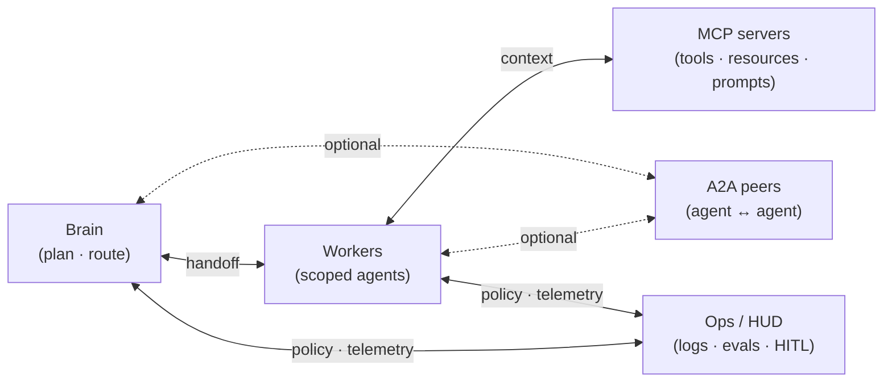

# Jarvis Architecture

## Purpose / Propósito

**PT:** Documentar uma **arquitetura de referência** multi-agent — **brain · workers · ops** — agnóstica de vendor. Goose, Cursor, Codex e CLIs aparecem como *exemplos*, não como dependências. Objetivo: times Staff conseguirem **trocar runtime sem reescrever o domínio**.

**EN:** Document a vendor-agnostic multi-agent **reference architecture** — **brain · workers · ops**. Goose, Cursor, Codex, and CLIs are *examples*, not hard dependencies. Goal: Staff teams can **swap runtimes without rewriting the domain**.

> Jarvis = nome do modelo mental. Este repo **não** é o monorepo privado de produto.

Maintainer: [Tiago Montanha](https://github.com/tiagovilasboas) · Staff · Agentic AI

---

## Model

| Layer | Responsibility |
|---|---|
| Brain | Plan, decompose, route |
| Workers | Narrow scope + tools ([MCP](https://modelcontextprotocol.io/docs/learn/architecture)) |
| Ops | Logs, evals, HITL on writes |

Prefer [simple, composable patterns](https://www.anthropic.com/engineering/building-effective-agents) (for example orchestrator–workers). Use [A2A](https://a2a-protocol.org/latest/topics/what-is-a2a/) when agents must collaborate as peers — do not wrap agents as tools.

**Swap a host without rewriting the domain:** [docs/swap-runtime.md](docs/swap-runtime.md).

---

## ADRs

Decision log (index + status): [docs/adr/README.md](docs/adr/README.md). Format: [adr.github.io](https://adr.github.io/).

- [0001 — Brain vs workers](docs/adr/0001-brain-vs-workers.md)
- [0002 — HITL on writes](docs/adr/0002-hitl-on-writes.md)
- [0003 — Vendor-agnostic](docs/adr/0003-vendor-agnostic.md)

---

## Inspired by

- [Goose architecture](https://block-goose.mintlify.app/concepts/architecture) · [agents/subagents](https://block-goose.mintlify.app/concepts/agents)
- [Building effective agents](https://www.anthropic.com/engineering/building-effective-agents)
- [OpenAI Agents SDK](https://github.com/openai/openai-agents-python)
- [A2A Protocol](https://a2a-protocol.org/) · [What is A2A?](https://a2a-protocol.org/latest/topics/what-is-a2a/) · [ACP](https://agentclientprotocol.com/)
- [LangGraph multi-agent](https://langchain-ai.github.io/langgraph/concepts/multi_agent/)
- [MCP](https://modelcontextprotocol.io) · [MCP architecture](https://modelcontextprotocol.io/docs/learn/architecture)
- [Architectural Decision Records](https://adr.github.io/)

Related: [awesome-agentic-ai](https://github.com/tiagovilasboas/awesome-agentic-ai) · [agent-measurement](https://github.com/tiagovilasboas/agent-measurement) · [kiro-playbook](https://github.com/tiagovilasboas/kiro-playbook)

## Contributing

See [CONTRIBUTING.md](CONTRIBUTING.md) for how to propose an ADR. Agent notes: [AGENTS.md](AGENTS.md).

## License

[MIT](LICENSE)
