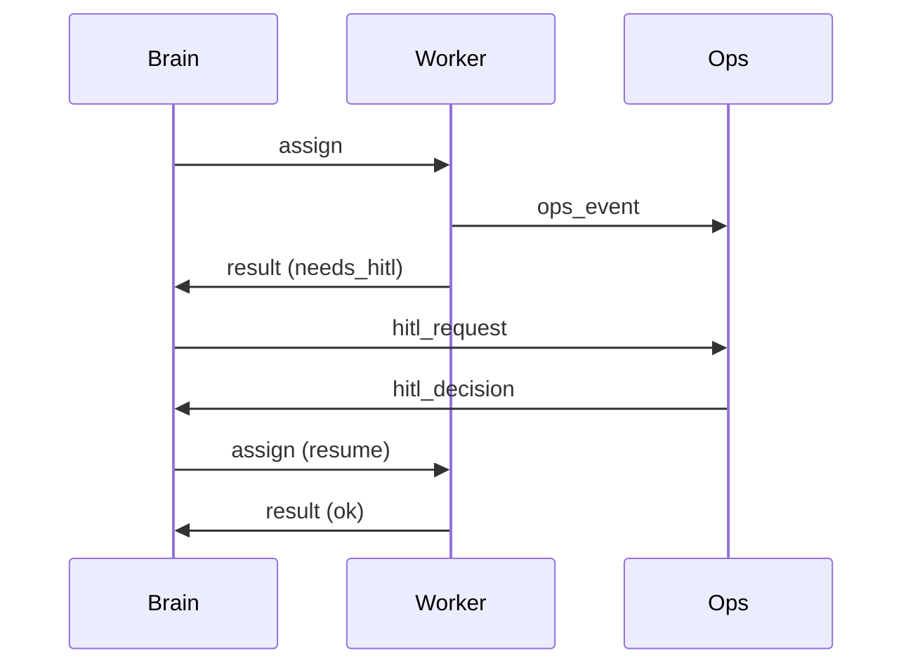

# Handoff cookbook

This is the contract [ADR 0001](adr/0001-brain-vs-workers.md) asked for and [ADR 0004](adr/0004-handoff-contracts.md) accepted. It is a **domain envelope**, not a product and not a wire protocol.

If ops cannot reconstruct the write, HITL is theater. If a host swap forces you to rewrite prompts because the payload was a pasted context window, the domain leaked into the runtime.

Aligned with:

- [ADR 0002 — HITL on writes](adr/0002-hitl-on-writes.md) (fail closed; reads may be optimistic)
- [ADR 0003 — Vendor-agnostic](adr/0003-vendor-agnostic.md)
- [Building effective agents](https://www.anthropic.com/engineering/building-effective-agents) (orchestrator–workers; add complexity only when it improves outcomes)
- [What is A2A?](https://a2a-protocol.org/latest/topics/what-is-a2a/) · [Life of a Task](https://a2a-protocol.org/latest/topics/life-of-a-task/)
- [MCP architecture](https://modelcontextprotocol.io/docs/learn/architecture) (agent-to-tool; not agent-to-agent)
- [ACP](https://agentclientprotocol.com/) (editor ↔ agent; permission requests)
- [LangGraph interrupts](https://docs.langchain.com/oss/python/langgraph/interrupts) (pause / resume, same thread)
- [OpenAI Agents SDK handoffs](https://openai.github.io/openai-agents-python/handoffs/) (example mapping: typed `input_type`, not the definition)
- [12-Factor Agents](https://github.com/humanlayer/12-factor-agents) (own control flow; treat HITL as a tool)
- [OWASP AISVS C09](https://github.com/OWASP/AISVS/blob/main/1.0/en/0x10-C09-Orchestration-and-Agentic-Action.md) (budgets, high-impact approval, fail closed on timeout)
- [OpenTelemetry GenAI conventions](https://opentelemetry.io/docs/specs/semconv/gen-ai/) (portable `trace_id`, not a vendor log)

## What a handoff is (and is not)

| Is | Is not |
| --- | --- |
| A typed JSON envelope between **brain · workers · ops** | A dump of the model's context window |
| Identity + goal + refs + write policy + acceptance | A vendor SDK type you import |
| Enough for HITL, eval, and resume | A2A, ACP, or MCP themselves |
| Versioned (`handoff/v1`) | A published package or HTTP API |

Brain plans and routes. Workers execute in a narrow scope with their own tool credentials ([ADR 0001](adr/0001-brain-vs-workers.md)). Ops owns logs, evals, and the approval gate. Do not wrap a peer agent as an MCP tool ([What is A2A?](https://a2a-protocol.org/latest/topics/what-is-a2a/)).



## Envelope

Illustrative types — not a published package. Extra fields are allowed. **Missing or unknown required fields fail closed.**

```ts
type Layer = "brain" | "worker" | "ops";
type Kind = "assign" | "result" | "ops_event" | "hitl_request" | "hitl_decision";
type WritePolicy = "hitl" | "deny" | "allowlist";
type ResultStatus = "ok" | "blocked" | "needs_hitl" | "failed";

type Actor = { layer: Layer; role: string };

type Ref = {
  kind: "uri" | "path" | "artifact" | "handoff";
  id: string;
};

type Handoff = {
  schema: "handoff/v1";
  id: string;
  correlation_id: string;
  parent_id: string | null;
  from: Actor;
  to: Actor;
  kind: Kind;
  goal: string;
  constraints: string[];
  inputs: { refs: Ref[]; inline?: Record<string, unknown> };
  budget: { tokens?: number; time_ms?: number; tools: string[] };
  write_policy: WritePolicy;
  acceptance: string[];
  observability: { trace_id: string; eval_suite?: string };
};
```

| Field | Required | Why it exists |
| --- | --- | --- |
| `schema` | yes | Pin the contract. Reject unknown versions. |
| `id` | yes | One unit of work. HITL and evals bind here. |
| `correlation_id` | yes | Groups a plan and its children (A2A `contextId`, OTel trace). |
| `parent_id` | yes (nullable) | Fan-out / resume. `null` on the root assign. |
| `from` / `to` | yes | Layer + role. Role is a worker scope, not a vendor name. |
| `kind` | yes | Which direction and speech act. |
| `goal` | yes | What done looks like in one or two sentences. |
| `inputs.refs` | yes | Pointers. Workers fetch with *their* credentials. |
| `write_policy` | yes | `hitl` default on mutations ([ADR 0002](adr/0002-hitl-on-writes.md)). |
| `acceptance` | yes | Checkable claims. If you cannot score it, it is not acceptance. |
| `observability.trace_id` | yes | Same id in logs and eval rows. |
| `budget.tools` | yes | Allowlist the worker may call. Empty means no tools. |
| `inputs.inline` | no | Tiny routing metadata only (reason, SHA, ticket id). |
| `budget.tokens` / `time_ms` | no | Enforce when you have a runtime that can ([AISVS 9.1.2](https://github.com/OWASP/AISVS/blob/main/1.0/en/0x10-C09-Orchestration-and-Agentic-Action.md)). |

`write_policy: allowlist` is explicit and named. It is not "the model looked safe."

## Directions

### `assign` — brain → worker

Brain decomposes; worker does not re-plan the whole job. Goal + constraints + refs + tool allowlist. No production secrets in the envelope.

### `result` — worker → brain

| `status` | Meaning |
| --- | --- |
| `ok` | Acceptance claims hold. Artifacts are refs. |
| `needs_hitl` | Mutation is ready; **do not apply it**. Attach `proposed_writes`. |
| `blocked` | Missing input, auth, or scope. Human or brain must unblock. |
| `failed` | Tried and lost. `errors` are factual, not a new plan. |

A write that executed under `write_policy: hitl` without a matching `hitl_decision` is a bug, not a `ok`.

### `ops_event` — any → ops

Progress, eval scores, traces. No side effects.

### `hitl_request` / `hitl_decision` — brain/worker ↔ ops

The request shows **canonical, untruncated** write parameters (diff, command, recipients, amounts) — [AISVS C9.2](https://github.com/OWASP/AISVS/blob/main/1.0/en/0x10-C09-Orchestration-and-Agentic-Action.md). Timeout without a decision **blocks** the write ([AISVS 9.6.2](https://github.com/OWASP/AISVS/blob/main/1.0/en/0x10-C09-Orchestration-and-Agentic-Action.md)). Decision binds to the same `id` (or a child whose `parent_id` is that id).

## Worked example — propose a merge

Domain: review a PR, then **propose** a merge. Merge is a write ([ADR 0002](adr/0002-hitl-on-writes.md)). Host can be Goose, Cursor, Codex, a CLI — irrelevant to the envelope.

### 1. Brain assigns the reviewer

```json
{
  "schema": "handoff/v1",
  "id": "hnd_7f3a2c10",
  "correlation_id": "corr_pr_1842",
  "parent_id": null,
  "from": { "layer": "brain", "role": "planner" },
  "to": { "layer": "worker", "role": "code-reviewer" },
  "kind": "assign",
  "goal": "Review PR 1842 against acceptance; propose merge only if the suite is green.",
  "constraints": [
    "Do not push, merge, or comment on the host.",
    "Findings need path:line. No invented issues."
  ],
  "inputs": {
    "refs": [
      { "kind": "uri", "id": "https://example.invalid/repo/pull/1842" },
      { "kind": "path", "id": "docs/adr/0002-hitl-on-writes.md" }
    ],
    "inline": { "head_sha": "a0efe3d11808", "base": "main" }
  },
  "budget": {
    "tokens": 80000,
    "time_ms": 180000,
    "tools": ["git.diff", "git.log", "evals.run"]
  },
  "write_policy": "hitl",
  "acceptance": [
    "Each finding has path:line and a quote from the diff.",
    "Merge is proposed, not applied.",
    "Eval suite pr-review reports pass or skip — never silent fail."
  ],
  "observability": {
    "trace_id": "4bf92f3577b34da6a3ce929d0e0e4736",
    "eval_suite": "pr-review"
  }
}
```

### 2. Worker reports: needs HITL

```json
{
  "schema": "handoff/v1",
  "id": "hnd_9c11e4aa",
  "correlation_id": "corr_pr_1842",
  "parent_id": "hnd_7f3a2c10",
  "from": { "layer": "worker", "role": "code-reviewer" },
  "to": { "layer": "brain", "role": "planner" },
  "kind": "result",
  "goal": "Review PR 1842 against acceptance; propose merge only if the suite is green.",
  "constraints": [],
  "inputs": {
    "refs": [
      { "kind": "handoff", "id": "hnd_7f3a2c10" },
      { "kind": "artifact", "id": "art_review_1842" }
    ]
  },
  "budget": { "tools": [] },
  "write_policy": "hitl",
  "acceptance": [],
  "observability": {
    "trace_id": "4bf92f3577b34da6a3ce929d0e0e4736",
    "eval_suite": "pr-review"
  },
  "status": "needs_hitl",
  "artifacts": [
    { "kind": "artifact", "id": "art_review_1842" }
  ],
  "evidence": [
    "evals.run pr-review → 6 pass, 0 fail, 1 skip (docs-only path)."
  ],
  "proposed_writes": [
    {
      "action": "merge_pull_request",
      "reversibility": "externally_reversible",
      "params": {
        "repo": "example/repo",
        "number": 1842,
        "head_sha": "a0efe3d11808",
        "method": "squash",
        "delete_branch": false
      }
    }
  ],
  "errors": []
}
```

`params` are enough to replay the write. Do not truncate them for a prettier HUD.

### 3. Brain opens HITL

```json
{
  "schema": "handoff/v1",
  "id": "hnd_hitl_1842",
  "correlation_id": "corr_pr_1842",
  "parent_id": "hnd_9c11e4aa",
  "from": { "layer": "brain", "role": "planner" },
  "to": { "layer": "ops", "role": "approver" },
  "kind": "hitl_request",
  "goal": "Approve or reject squash-merge of PR 1842 at sha a0efe3d11808.",
  "constraints": ["Timeout without a decision blocks the merge."],
  "inputs": {
    "refs": [
      { "kind": "handoff", "id": "hnd_9c11e4aa" },
      { "kind": "artifact", "id": "art_review_1842" }
    ],
    "inline": {
      "action": "merge_pull_request",
      "params": {
        "repo": "example/repo",
        "number": 1842,
        "head_sha": "a0efe3d11808",
        "method": "squash",
        "delete_branch": false
      }
    }
  },
  "budget": { "time_ms": 86400000, "tools": [] },
  "write_policy": "hitl",
  "acceptance": ["Decision is approve or reject, bound to hnd_hitl_1842."],
  "observability": { "trace_id": "4bf92f3577b34da6a3ce929d0e0e4736" }
}
```

### 4. Ops decides

```json
{
  "schema": "handoff/v1",
  "id": "hnd_hitl_1842_dec",
  "correlation_id": "corr_pr_1842",
  "parent_id": "hnd_hitl_1842",
  "from": { "layer": "ops", "role": "approver" },
  "to": { "layer": "brain", "role": "planner" },
  "kind": "hitl_decision",
  "goal": "Approve or reject squash-merge of PR 1842 at sha a0efe3d11808.",
  "constraints": [],
  "inputs": {
    "refs": [{ "kind": "handoff", "id": "hnd_hitl_1842" }],
    "inline": {
      "decision": "approve",
      "actor": "human:ada",
      "bound_sha": "a0efe3d11808"
    }
  },
  "budget": { "tools": [] },
  "write_policy": "hitl",
  "acceptance": [],
  "observability": { "trace_id": "4bf92f3577b34da6a3ce929d0e0e4736" }
}
```

Brain may then assign a **merger** worker with `write_policy: allowlist` scoped to that one `merge_pull_request` at that SHA — or apply the write in ops. Either way, the decision id is in the next assign's `inputs.refs`. A new SHA means a new HITL. Re-using an approval after the head moved is a failed control.

### 5. Ops event (eval row)

```json
{
  "schema": "handoff/v1",
  "id": "hnd_evt_1842_eval",
  "correlation_id": "corr_pr_1842",
  "parent_id": "hnd_7f3a2c10",
  "from": { "layer": "worker", "role": "code-reviewer" },
  "to": { "layer": "ops", "role": "eval" },
  "kind": "ops_event",
  "goal": "Record pr-review scores for hnd_7f3a2c10.",
  "constraints": [],
  "inputs": {
    "refs": [{ "kind": "handoff", "id": "hnd_7f3a2c10" }],
    "inline": {
      "event": "eval",
      "suite": "pr-review",
      "pass": 6,
      "fail": 0,
      "skip": 1
    }
  },
  "budget": { "tools": [] },
  "write_policy": "deny",
  "acceptance": [],
  "observability": {
    "trace_id": "4bf92f3577b34da6a3ce929d0e0e4736",
    "eval_suite": "pr-review"
  }
}
```

## Mapping (do not collapse)

| This envelope | Public mapping |
| --- | --- |
| `id` | A2A `taskId`; LangGraph node on a thread; one eval row |
| `correlation_id` | A2A `contextId`; LangGraph `thread_id`; OTel trace |
| `parent_id` / `inputs.refs` of kind `handoff` | A2A `referenceTaskIds` |
| `status: needs_hitl` | A2A `input-required`; ACP permission request; LangGraph interrupt; MCP [elicitation](https://modelcontextprotocol.io/specification/latest/client/elicitation) |
| `artifacts` | A2A `Task.artifacts`; ACP diffs; worker MCP tool results |
| `budget.tools` | MCP tool allowlist on that worker — not the whole host catalog |
| `assign` payload | OpenAI Agents SDK `handoff(..., input_type=…)` as *one* adapter |

A2A is how **peers** talk. MCP is how a worker reaches **tools**. ACP is how an **editor** talks to an agent. This envelope is how **our layers** talk. Map at the edge; do not fork the domain for one SDK ([docs/swap-runtime.md](swap-runtime.md)).

[Life of a Task](https://a2a-protocol.org/latest/topics/life-of-a-task/) treats a terminal task as immutable. Same rule here: do not mutate `hnd_7f3a2c10` after a terminal `result`. Resume is a **new** handoff with `parent_id` set.

## Anti-patterns

| Smell | Why it fails |
| --- | --- |
| Paste the transcript as the assign | Cannot eval, cannot HITL, cannot swap the host |
| Secrets on the brain payload | Violates [ADR 0001](adr/0001-brain-vs-workers.md) |
| `status: ok` plus a merge that already ran | Write skipped the gate ([ADR 0002](adr/0002-hitl-on-writes.md)) |
| Truncated `proposed_writes` in the HUD | Approver rubber-stamps a different action than the runtime |
| Worker named `cursor-agent` / `goose-subagent` | Vendor leaked into the domain ([ADR 0003](adr/0003-vendor-agnostic.md)) |
| Peer agent wrapped as an MCP tool | [A2A anti-pattern](https://a2a-protocol.org/latest/topics/what-is-a2a/) |
| Reuse HITL after `head_sha` changed | Approval unbound from parameters |
| New required field without bumping `handoff/v1` | Silent incompatibility across hosts |

## Ship check

You are done when a Staff engineer can:

1. Emit `assign` / `result` / `hitl_*` without naming a host.
2. Approve a write from `proposed_writes.params` alone — and reject a truncated payload.
3. Point a different host at the same envelope and keep [swap-runtime](swap-runtime.md) step 6 (same eval, no domain fork).

## Out of scope

- Transport (queue, stdio, HTTP) and persistence.
- Cryptographic binding of approvals ([AISVS 9.2.8](https://github.com/OWASP/AISVS/blob/main/1.0/en/0x10-C09-Orchestration-and-Agentic-Action.md)) — ops may add it; the envelope still needs the ids.
- A JSON Schema file or SDK. Propose that only if a second host actually maps this shape.

New architecturally significant decisions: [CONTRIBUTING.md](../CONTRIBUTING.md) and the [decision log](adr/README.md).
